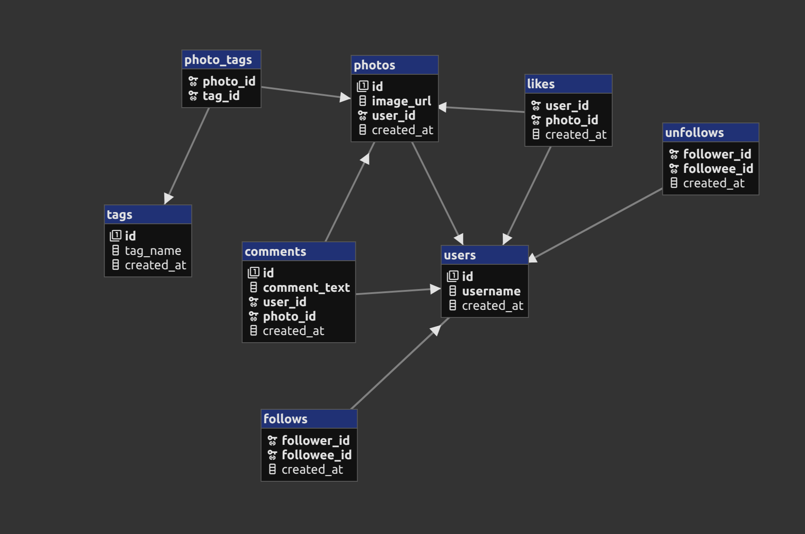

# Instagram SQL Analytics

This project analyzes a simulated Instagram-style database using SQL. The aim is to answer real business questions related to user activity, engagement, and content performance. The dataset includes users, photos, likes, comments, follows, unfollows and hashtags. All queries are written in MySQL.

---

## Database Overview

The database consists of the following tables:

- **users**
- **photos**
- **likes**
- **comments**
- **follows**
- **unfollows**
- **tags**
- **photo_tags**

---

## ER Diagram

---

## Business Problems Solved

This project focuses on solving practical analytical questions using SQL:

1. **Find the 5 oldest users**  
   Helps identify long-term users for reward programs.

2. **Determine the most common registration day**  
   Useful for planning ad campaigns or onboarding boosts.

3. **List users who have never posted a photo**  
   Targets inactive users for re-engagement.

4. **Identify the photo with the highest number of likes**  
   Used for contest results or engagement tracking.

5. **Calculate the average number of posts per user**  
   Helpful for product analytics and investor metrics.

6. **Find the top 5 most commonly used hashtags**  
   Supports brand and influencer posting strategies.

7. **Find users who have liked every photo**  
   Helps detect suspicious or bot-like behavior.

8. **Find users who have never commented on any photo**  
   Useful for distinguishing passive users.

9. **Calculate the percentage of users who either never commented or commented on every photo**  
   Measures extreme engagement patterns.

All SQL solutions are included in `ig-solved-business-problems.sql`.

---

## How to Run the Project

1. Import the schema and sample data using:  
   `ig-dataset.sql`
2. Open and execute the analytical queries from:  
   `ig-solved-business-problems.sql`
3. Use any MySQL environment (MySQL CLI, Workbench, phpMyAdmin, etc.)

No additional setup is required.

---

## Skills Demonstrated

- Multi-table JOINs
- Aggregate functions and GROUP BY
- Subqueries and nested filtering
- Data interpretation from query results
- Writing queries based on real business requirements

---

## Files in This Repository

- `ig-dataset.sql` – database tables and sample data
- `ig-solved-business-problems.sql` – solutions to all 9 business questions

---
